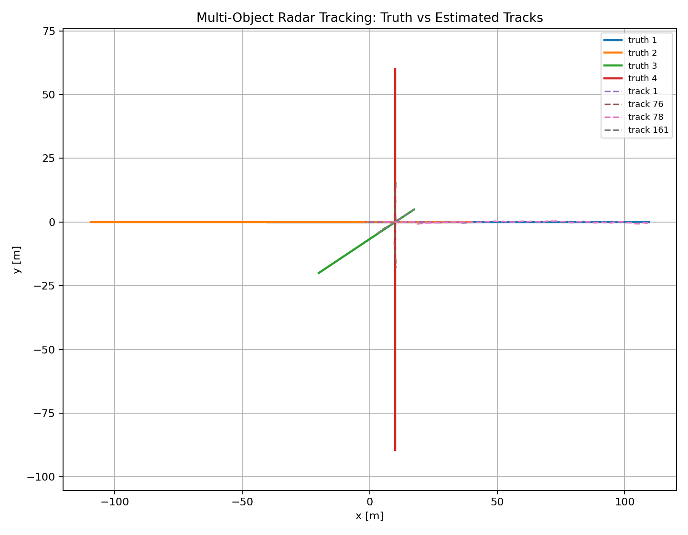
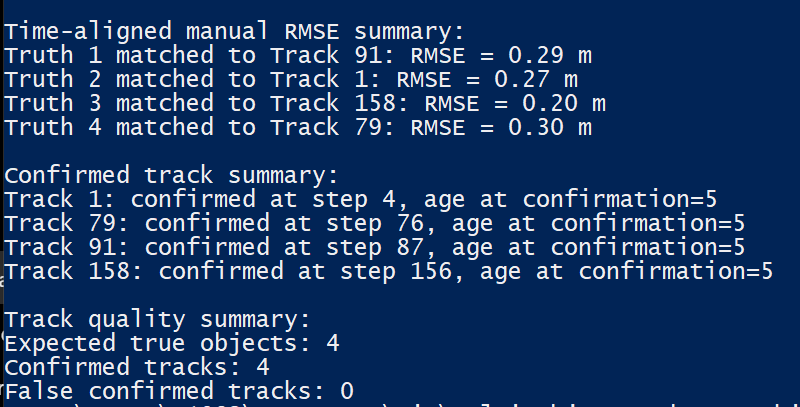
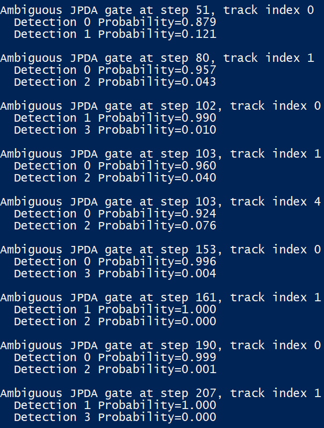
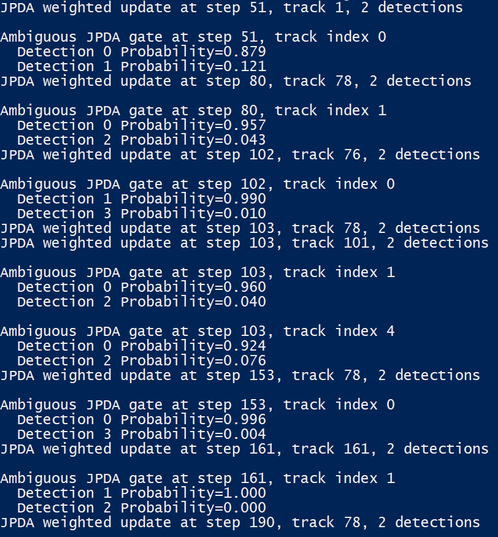

# Multi-Object Radar Tracking Simulator

A Python-based multi-object radar tracking framework implementing automotive-style target tracking using Kalman filtering, Mahalanobis gating, Global Nearest Neighbor (GNN) data association, and track lifecycle management.

This project was developed to study and implement the core principles used in modern radar perception systems for automotive, robotics, UAV, and intelligent transportation applications.

## Features

### Radar Measurement Simulation
The framework includes a configurable radar sensor simulator capable of generating:

- Range measurements
- Azimuth measurements
- Radial velocity (Doppler) measurements
- Measurement noise
- Missed detections
- Clutter / false alarms

---

### Multi-Target Tracking
The tracker supports simultaneous tracking of multiple moving objects in a traffic-like environment.

Implemented components:

- Constant Velocity Kalman Filter
- Prediction and update cycles
- State covariance propagation
- Measurement updates

---

### Mahalanobis Gating
Measurement validation is performed using Mahalanobis distance gating.

Benefits:

- Rejects unlikely measurements
- Reduces false associations
- Improves computational efficiency

---

### Global Nearest Neighbor (GNN)
Data association is implemented using:

- Cost matrix generation
- Mahalanobis distance metrics
- Hungarian assignment algorithm

This provides globally optimal one-to-one assignment between detections and tracks.

---

### Track Lifecycle Management

Implemented track states:

- Tentative
- Confirmed
- Deleted

Track management includes:

- Track initiation
- Confirmation logic
- Missed detection handling
- Track deletion

Implemented track states:

- Tentative
- Confirmed
- Deleted

Track management includes:

- Track initiation
- Confirmation logic
- Missed detection handling
- Track deletion

---

### Performance Evaluation

Implemented metrics:

- Time-aligned RMSE evaluation
- Track confirmation analysis
- False track statistics

---

### Tracking Pipeline

```text
Synthetic traffic scenario
      ↓
Radar measurement generation
      ↓
Noise + Clutter + Missed detections
      ↓
Kalman prediction
      ↓
Mahalanobis Gating
      ↓
GNN Data association
      ↓
Kalman Measurement Update 
	  ↓     
Track Management
      ↓
Confirmed Object Tracks

```

## Results

### Tracking Performance
| Truth Object | Assigned Track  | RMSE |
| ------------ | --------------- | -----|
|Truth 1	   |  Track 91	     |0.29 m|
|Truth 2	   |  Track 1	     |0.27 m|
|Truth 3	   |  Track 158	     |0.20 m|
|Truth 4	   |  Track 79	     |0.30 m|

### Track Quality

| Metric                | value |
| ----------------------| ------|
|Expected True Objects  |   4   |
|Confirmed Tracks       |   4   |
|False Confirmed Tracks |   0   |

### Track Confirmation

| Track ID | Confirmation Step |
| ---------| ----------------- |
|    1     |        4          |
|    79    |        76         |
|    91    |        7          |
|    158   |       156         |


---

## Example Tracking Output

### Ground Truth vs Estimated Tracks

<p align="center">

</p>


### Tracking Metrics

<p align="center">

</p>

--- 
## JPDA Validation and Ambiguous Association Analysis

To investigate limitations of Global Nearest Neighbor (GNN) association, the tracker was extended with JPDA-style validation gates and probabilistic association analysis.

For each predicted track:

1. Mahalanobis validation gates are computed
2. All detections inside the gate are retained
3. Association likelihoods are computed from Mahalanobis distances
4. Normalized association probabilities are generated

This allows the tracker to identify ambiguous target-detection assignments, particularly during target crossing and clutter-rich scenarios.

Example output:

```text
Ambiguous JPDA gate at step 51, track index 0

Detection 0 Probability = 0.879
Detection 1 Probability = 0.121

Ambiguous JPDA gate at step 80, track index 1

Detection 0 Probability = 0.957
Detection 2 Probability = 0.043
```
These results demonstrate that multiple measurements can simultaneously satisfy a track's validation gate and motivate probabilistic association methods such as Joint Probabilistic Data Association (JPDA).

Current implementation:

- Validation gate generation
- Association likelihood computation
- Association probability normalization

Planned next step:

- Full JPDA weighted Kalman update

### Example JPDA Validation Output

<p align="center">

</p>

---

## JPDA Weighted Update

The tracker was extended from JPDA validation-only analysis to a practical JPDA-style weighted measurement update.

When multiple detections fall inside a track gate, the measurement update uses a probability-weighted measurement instead of a single hard GNN assignment.

Example:

```text
JPDA weighted update at step 51, track 1, 2 detections
Detection 0 Probability=0.879
Detection 1 Probability=0.121
```
### Example JPDA Weighted Update Output

<p align="center">

</p>

---

## Run

```bash
python -m src.mot.run_demo
```

## Planned Extensions

- Complete JPDA weighted Kalman update
- Joint association hypothesis management
- Bernoulli / Random Finite Set tracking
- Radar-camera fusion
- Embedded C implementation

---

## Technologies
- Python
- NumPy
- SciPy
- Matplotlib
- Kalman Filtering
- Multi-Object Tracking
- Hungarian Assignment
- Radar Perception

## Author
**Vasan Iyer**   
Embedded Software Engineer

Areas of interest:
- Radar Tracking
- Sensor Fusion
- Autonomous Systems
- FPGA Signal Processing
- Embedded C firmware
- STM32 microcontrollers
- Real-time embedded systems
- Communication interfaces (CAN, SPI, UART)
- FPGA-based hardware interfacing
- Embedded debugging and system integration

GitHub: https://github.com/Vaiy108
